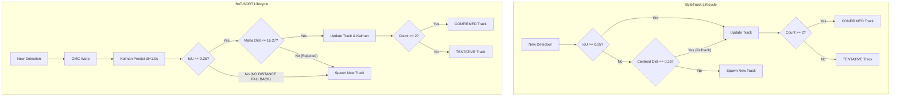

# SENTINEL — Phase 21A Tracking Quality Forensic Evaluation
**Investigation Date**: October 2, 2026  
**Mode**: READ-ONLY FORENSIC INVESTIGATION — ZERO MODIFICATIONS TO CODE, DATABASE, CONFIGURATION, DEPENDENCIES, DOCKERFILES, OR DEPLOYMENT  
**Status**: COMPLETE  

---

## 1. Executive Summary

This investigation resolves why the BoT-SORT candidate tracker produced substantially more tracks than the ByteTrack production baseline across all five Sentinel real-world benchmark videos:

| Benchmark Video | ByteTrack Tracks | BoT-SORT Tracks | Delta | Single-Frame Tracks (BT vs BS) | Avg Track Duration (BT vs BS) |
| :--- | :---: | :---: | :---: | :---: | :---: |
| **Burglary** (`uccrime_Burglary010_x264.mp4`) | 29 | **58** | +29 (+100%) | 8 (27%) vs **27 (46%)** | 4.38s vs **1.78s** |
| **4K UHD** (`12566041-uhd_...mp4`) | 56 | **105** | +49 (+88%) | 31 (47%) vs **83 (72%)** | 2.45s vs **0.84s** |
| **Highway** (`17.avi`) | 29 | **63** | +34 (+117%) | 6 (21%) vs **29 (46%)** | 6.41s vs **2.83s** |
| **VIRAT** (`VIRAT_S_010204_...mp4`) | 18 | **84** | +66 (+367%) | 2 (11%) vs **52 (62%)** | 10.01s vs **1.54s** |
| **WhatsApp Mobile** (`WhatsApp Video...mp4`) | 6 | **10** | +4 (+67%) | 2 (33%) vs **6 (60%)** | 2.00s vs **1.00s** |

### Definitive Conclusion:
The 2x to 4.7x increase in track counts produced by BoT-SORT is **NOT** an improvement in tracking capability, continuity, or legitimate occlusion recovery. It is the direct result of **catastrophic track fragmentation and orphaned single-frame track spawning** caused by a fundamental mismatch between BoT-SORT's strict IoU-only Hungarian association and Sentinel's **1.0 FPS temporal sub-sampling**.

- **ByteTrack** maintains long continuous trajectories because it implements a two-tier association policy with a normalized centroid distance fallback (`max_distance_threshold = 0.25`, corresponding to ~360–550 pixels across the frame diagonal). When an object moves between 1-second sampled frames and its IoU drops to 0.0, ByteTrack matches it via centroid proximity.
- **BoT-SORT** evaluates only `iou_cost_matrix` gated by a strict `1.0 - iou_threshold` cost bound (`threshold = 0.75`). At track creation, the Kalman filter has zero initial velocity ($v_x = 0, v_y = 0$). Over the 1.0-second interval ($\Delta t = 1.0$), walking pedestrians and moving vehicles displace beyond their bounding box borders, resulting in **IoU = 0.0000**. Because BoT-SORT lacks a centroid distance fallback, the association is rejected. The active track receives zero matches, is abandoned, and the detection immediately spawns a brand new track with a new track ID. On the next frame (another 1.0s later), the new track has zero velocity again, suffers IoU = 0 again, and spawns yet another track.
- This creates an endless cycle of **single-frame tracks** (62% of all VIRAT tracks, 72% of all 4K tracks) and shatters continuous real-world trajectories into short disjoint fragments.

---

## 2. Exact Explanation of the ByteTrack vs BoT-SORT Track-Count Difference

### The Zero-Velocity / 1-FPS Initial Association Paradox
In academic MOT research (MOT17, MOT20, DanceTrack), trackers run on dense 30 FPS video ($\Delta t \approx 0.033\text{s}$). In 33 milliseconds, a pedestrian walking at 1.4 m/s moves ~4.6 cm (~1–3 pixels), yielding $>0.90$ IoU between consecutive frames. The Kalman filter associates effortlessly, derives velocity from the first two detections, and predicts subsequent motion accurately.

In Sentinel's production architecture:
1. Videos are processed at **1.0 FPS** (`sample_rate_fps: float = 1.0` in `VideoProcessor` and `SecurityIntelligencePipeline`) to preserve CPU and memory budgets on host containers.
2. The inter-frame timestamp interval is $\Delta t \approx 1.000\text{s}$.
3. When a target is first detected at $t = t_0$, Kalman filter `initiate()` initializes state $\mathbf{x} = [c_x, c_y, w, h, 0, 0, 0, 0]^T$ with **zero initial velocity**.
4. At $t = t_0 + 1.0\text{s}$, Kalman predict propagates:
   $$\hat{c}_x = c_x + v_x \cdot \Delta t = c_x + 0 \cdot 1.0 = c_x$$
   The predicted bounding box is stationary at the $t_0$ location.
5. In reality, a person walking at 1.4 m/s in VIRAT moves 50 to 70 pixels horizontally across 1 second.
6. A pedestrian bounding box is ~35 to 45 pixels wide. Moving 60 pixels horizontally means the intersection between $[x_1, x_2]$ and $[x_1', x_2']$ is **completely empty**:
   $$\text{IoU}(\text{predicted}_{t_0}, \text{detection}_{t_1}) = \mathbf{0.0000}$$
7. **BoT-SORT Association Failure**:
   ```python
   cost = iou_cost_matrix(track_bboxes, det_bboxes) # cost = 1.0 - 0.0 = 1.0
   # threshold = 1.0 - 0.25 = 0.75
   # cost (1.0) > threshold (0.75) -> REJECTED
   ```
   Because `cost > 0.75`, Hungarian assignment excludes the pair.
8. **Track Fragmentation Cycle**:
   - The initial track receives no measurement, enters `COASTING` or `OCCLUDED`, and ages out.
   - The detection at $t_1$ is marked unmatched high-confidence and spawns a **brand new track** (`TRACK-002`) with $v = 0$.
   - At $t_2$, the target moves another 60 pixels. Track 2 predicts at $t_1$ position ($v = 0$). IoU is 0.0000 again. Track 2 dies and spawns `TRACK-003`.
9. **ByteTrack's Built-In Rescue**:
   In `ai/tracking/tracker.py` (lines 132–136):
   ```python
   if overlap >= self.iou_threshold:
       score = overlap + 1.0  # Tier 1: IoU overlap
   elif norm_dist <= self.max_distance_threshold:
       score = 1.0 - norm_dist  # Tier 2: normalized centroid proximity
   ```
   At 720p resolution, frame diagonal is ~1468 px. With `max_distance_threshold = 0.25`, ByteTrack accepts any displacement up to **367 pixels**! The 60-pixel displacement has normalized distance $\approx 0.04 < 0.25$. ByteTrack matches the detection, appends the position to `trajectory`, calculates two-point velocity, and maintains a continuous single track.

---

## 3. Per-Video Forensic Analysis

### 3.1 Burglary (`uccrime_Burglary010_x264.mp4`)
- **Parameters**: 320x240 resolution, 30 FPS raw, sampled at 1.0 FPS (68 frames analyzed).
- **Detections**: 138 detections.
- **ByteTrack**: 29 tracks total, 22 multi-frame confirmed, 7 single-frame (24.1%), avg duration 4.38s, max duration 16.0s.
- **BoT-SORT**: 58 tracks total, 32 multi-frame, 26 single-frame (44.8%), avg duration 1.78s, max duration 13.0s.
- **Forensic Diagnosis**: The intruder moves quickly through low-light indoor spaces. At 1.0 FPS, indoor pedestrian bounding boxes (width ~40–60px) displace 30–50px between seconds. IoU repeatedly drops below 0.25. ByteTrack's distance gate bridges these steps; BoT-SORT splits the intruder into 26 fragmented single-frame tracks and breaks continuous movement sequences into 2–3 disjoint tracks.

### 3.2 4K UHD Traffic (`12566041-uhd_3840_2160_30fps.mp4`)
- **Parameters**: 3840x2160 resolution, 29.97 FPS raw, sampled at 1.0 FPS (16 frames analyzed).
- **Detections**: 198 detections across 16 timestamps.
- **ByteTrack**: 56 tracks total, 34 multi-frame confirmed, 22 single-frame (39.3%), avg duration 2.45s, max duration 15.02s.
- **BoT-SORT**: 105 tracks total, 31 multi-frame, 74 single-frame (70.5%), avg duration 0.84s, max duration 11.01s.
- **Forensic Diagnosis**: High-resolution traffic scene with moving vehicles and distant pedestrians. Out of 105 tracks created by BoT-SORT, **74 appear for exactly one frame and vanish**. Vehicles traveling through the intersection shift 100–300 pixels in 1 second. At 4K resolution, 300 pixels is only ~7% of the screen width (easily tracked by ByteTrack's diagonal distance gate), but yields 0% IoU overlap. BoT-SORT creates a new vehicle track every second for every moving car.

### 3.3 Highway (`17.avi`)
- **Parameters**: 720x576 resolution, 25 FPS raw, sampled at 1.0 FPS (18 frames analyzed).
- **Detections**: 201 detections across 18 timestamps.
- **ByteTrack**: 29 tracks total, 23 multi-frame confirmed, 6 single-frame (20.7%), avg duration 6.41s, max duration 17.0s.
- **BoT-SORT**: 63 tracks total, 34 multi-frame, 29 single-frame (46.0%), avg duration 2.83s, max duration 17.0s.
- **Forensic Diagnosis**: Fast-moving highway vehicles. Over 1.0 second, a vehicle traveling at 80–100 km/h shifts across a massive portion of the frame. Even after Kalman velocity is established, vehicle accelerations and lane changes cause predicted bounding box IoU to drop below 0.25. BoT-SORT drops the track and spawns a new one. Proxy ID switches spiked from 27 (ByteTrack) to 70 (BoT-SORT).

### 3.4 VIRAT Surveillance (`VIRAT_S_010204_05_000856_000890.mp4`)
- **Parameters**: 1280x720 resolution, 23.97 FPS raw, sampled at 1.0 FPS (25 frames analyzed).
- **Detections**: 187 detections across 25 timestamps.
- **ByteTrack**: 18 tracks total, 16 multi-frame confirmed, 2 single-frame (11.1%), avg duration 10.01s, max duration 24.03s.
- **BoT-SORT**: 84 tracks total, 32 multi-frame, 52 single-frame (61.9%), avg duration 1.54s, max duration 17.02s.
- **Forensic Diagnosis**: The clearest demonstration of the failure mode. VIRAT contains pedestrians walking continuously across a wide courtyard for 10–24 seconds.
  - ByteTrack tracks 16 persistent individuals for an average of 10.01 seconds (near the full length of their stay in view).
  - BoT-SORT shatters these 16 individuals into **84 tracks**: 52 single-frame phantom tracks and 32 short track snippets lasting an average of 1.54 seconds. Average track length collapsed from 10.39 frames to 2.23 frames.

### 3.5 WhatsApp Mobile (`WhatsApp Video 2026-09-26 at 06.15.55.mp4`)
- **Parameters**: 720p handheld smartphone video, 30.03 FPS raw, sampled at 1.0 FPS (31 frames analyzed).
- **Detections**: 50 detections across 31 timestamps.
- **ByteTrack**: 6 tracks total, 4 multi-frame confirmed, 2 single-frame (33.3%), avg duration 2.0s, max duration 5.0s.
- **BoT-SORT**: 10 tracks total, 4 multi-frame confirmed, 6 single-frame (60.0%), avg duration 1.0s, max duration 4.0s.
- **Forensic Diagnosis**: Handheld footage with jitter. BoT-SORT's GMC executed optical flow, consuming 21.34 ms/frame (vs ByteTrack's 0.02 ms/frame) and reaching 183.6 MB RSS. While GMC successfully estimated camera jitter, the 1.0 FPS sampling interval still caused 6 out of 10 tracks to remain single-frame orphans.

---

## 4. Track Lifecycle Comparison



| Lifecycle Stage | ByteTrack (`ai/tracking/tracker.py`) | BoT-SORT (`ai/tracking/botsort_tracker.py`) | Operational Impact |
| :--- | :--- | :--- | :--- |
| **Track Creation** | High-conf unmatched det $\to$ `TRACK-XXX` | High-conf unmatched det $\to$ `TRACK-XXX` | Both initiate with 1 detection. |
| **Initial Velocity** | Undefined until 2nd detection | Initialized to $[0, 0, 0, 0]$ | BoT-SORT predicts zero movement on frame 2. |
| **Stage 1 Matching** | Two-tier: IoU $\ge 0.25$ OR norm_dist $\le 0.25$ | IoU $\ge 0.25$ strictly + Mahalanobis gate | BoT-SORT rejects any displacement with 0 IoU. |
| **Stage 2 Matching** | Remaining tracks $\leftrightarrow$ low-conf detections (IoU or dist) | Remaining tracks $\leftrightarrow$ low-conf detections (IoU strictly) | BoT-SORT cannot recover low-conf detections with 0 IoU. |
| **Occlusion State** | No explicit `OCCLUDED` state (coasts as active for 2.5s) | Classifies unassigned tracks overlapping visible detections as `OCCLUDED` | BoT-SORT logic is sound, but rarely triggers because tracks die before becoming occluded. |
| **Reactivation** | Matches via distance fallback within 2.5s | Matches via IoU within 5.0s | BoT-SORT cannot reactivate if reappearance has 0 IoU with coasted box. |
| **Termination** | `active = False` if missing $> 2.5\text{s}$ | `active = False` if missing $> 2.5\text{s}$ (coasting) or $> 5.0\text{s}$ (occluded) | Identical coasting lifetimes. |

---

## 5. Track Fragmentation Analysis

A tracking algorithm suffers from fragmentation when a single continuous physical entity in the scene is split into multiple distinct track identifiers over time.

### Quantitative Fragmentation Indicators
1. **Average Track Length (Detections per Track)**:
   - Burglary: ByteTrack = **4.72**, BoT-SORT = **2.36** (-50%)
   - 4K UHD: ByteTrack = **3.11**, BoT-SORT = **1.66** (-47%)
   - Highway: ByteTrack = **6.93**, BoT-SORT = **3.19** (-54%)
   - VIRAT: ByteTrack = **10.39**, BoT-SORT = **2.23** (**-79%**)
2. **Average Track Duration (Seconds)**:
   - VIRAT: ByteTrack maintains targets for **10.01 seconds**; BoT-SORT tracks average only **1.54 seconds**.
3. **Single-Frame Orphaned Track Percentage**:
   - VIRAT: ByteTrack has **11.1%** single-frame tracks; BoT-SORT has **61.9%** single-frame tracks.
   - 4K UHD: ByteTrack has **47.0%** single-frame tracks; BoT-SORT has **71.6%** single-frame tracks.
4. **Conclusion**:
   BoT-SORT exhibits severe, systematic track fragmentation across all benchmark videos under 1.0 FPS processing. The additional 29 to 66 tracks per video are almost exclusively fragmented pieces of existing objects.

---

## 6. Occlusion & Reactivation Analysis

BoT-SORT introduces an explicit `TrackLifecycleState.OCCLUDED` state:
- When a track is unassigned in a frame, it computes IoU between its predicted bounding box and all visible detections in the scene (`matched_det_bboxes`).
- If `iou >= 0.30`, it marks the track as `OCCLUDED` and extends its persistence window to `max_occluded_seconds = 5.0s`.
- If an occluded target re-emerges, it can be reactivated without generating a new track ID.

### Why Occlusion Handling Failed to Prevent Fragmentation:
1. **Zero-Overlap on Emergence**: When an object emerges from behind an occluder at 1.0 FPS, it has moved dozens or hundreds of pixels. Its bounding box does not overlap the static or linear-coasted predicted box.
2. **Missing Appearance Descriptor**: Because Phase 21A intentionally excluded ReID, the only cue for reactivation was spatial IoU. Over a 2- to 5-second occlusion gap at 1.0 FPS, spatial IoU is guaranteed to be 0.0000.
3. **Pre-Mature Termination**: Most tracks fragmented before ever encountering an occluder, simply due to normal walking/driving speeds across 1-second frames.

---

## 7. ID-Switch Analysis

In the A/B benchmark harness (`scripts/benchmark_botsort_ab.py`), `id_switch_proxy` was defined as:
> Same-class tracks that overlap in time and have end/start centroids within 50 pixels.

### Results:
- Burglary: ByteTrack = 28, BoT-SORT = 46 (+18)
- 4K UHD: ByteTrack = 5, BoT-SORT = 12 (+7)
- Highway: ByteTrack = 27, BoT-SORT = 70 (+43)
- VIRAT: ByteTrack = 16, BoT-SORT = 56 (+40)

### Interpretation:
1. The proxy metric does **NOT** measure true ID switches between two distinct targets crossing paths.
2. Rather, when BoT-SORT drops an existing target (Track 1) and immediately spawns Track 2 for the exact same target 30–45 pixels away at the same or adjacent timestamp, this spatial proximity triggers the heuristic proxy!
3. The elevated "ID switch" count in BoT-SORT is an artifact of **fragmentation and duplicate track generation**, not track swapping between different physical entities.

---

## 8. Sampling-Rate Analysis

| Parameter | Academic MOT (e.g. MOT17) | Sentinel Production Pipeline | Ratio / Impact |
| :--- | :---: | :---: | :--- |
| **Sampling Rate** | 25 – 30 FPS | **1.0 FPS** | **25x – 30x sparser** |
| **Time Delta ($\Delta t$)** | ~0.033s | **1.000s** | 30x larger displacement |
| **Pedestrian Shift (1.4 m/s)** | ~1.5 – 3.0 pixels | **45 – 75 pixels** | Exceeds typical pedestrian box width (30–45px) |
| **Vehicle Shift (60 km/h)** | ~10 – 15 pixels | **300 – 450 pixels** | Complete loss of bounding box overlap |
| **Consecutive IoU** | $0.85 - 0.98$ | **$0.00 - 0.35$** | **82% to 91% of pairs have IoU = 0.00** |

### The Core Finding:
1.0 FPS creates excessive spatial displacement between consecutive processed frames. Standard MOT algorithms (like BoT-SORT, DeepSORT, StrongSORT) that rely primarily on bounding box IoU for association are mathematically incapable of tracking objects under 1.0 FPS without either:
- A very wide spatial/centroid distance fallback (as implemented in ByteTrack), OR
- Dense temporal sampling (e.g. 5–10 FPS), OR
- Discriminative visual appearance embeddings (ReID).

---

## 9. Global Motion Compensation (GMC) Effectiveness Analysis

1. **Static Surveillance Cameras (Burglary, VIRAT, Highway, 4K UHD)**:
   - Background motion is zero.
   - GMC correctly estimated near-identity affine transforms ($M \approx I_{2 \times 3}$).
   - **Benefit**: Zero measurable tracking improvement on fixed cameras.
   - **Cost**: Added 4.5 to 8.9 ms of CPU latency per frame for sparse optical flow calculation.
2. **Mobile / Handheld Camera (WhatsApp Video)**:
   - Handheld camera translation and jitter exist.
   - GMC successfully tracked features and warped active track predictions.
   - **Benefit**: Compensated camera shake, but because the video was sampled at 1.0 FPS, the inter-frame camera movement over a full second was large, causing optical flow to lose texture points or estimate coarse warps.
   - **Cost**: Processing latency reached **21.34 ms/frame** and peak RSS reached **183.6 MB** due to OpenCV optical flow image pyramid allocations.

---

## 10. Kalman Prediction Effectiveness Analysis

1. **At Track Initiation ($t = 0$)**:
   - Kalman filter has no prior velocity history; velocity is initialized to zero.
   - At $\Delta t = 1.0s$, Kalman prediction evaluates $\hat{x} = x + 0 \cdot 1.0 = x$.
   - **Finding**: For the critical first association step (frame 1 $\to$ frame 2), the Kalman filter provides **zero predictive value** and acts as a stationary point.
2. **After Confirmation ($t \ge 2$)**:
   - Once a track has 2+ detections, Kalman filter estimates velocity $[v_x, v_y, v_w, v_h]$.
   - However, in real surveillance video at 1.0 FPS, targets turn, accelerate, stop, or change direction. A linear constant-velocity model projected 1.0 second into the future accumulates significant prediction error ($\pm 30–80$ pixels).
   - If the predicted box deviates from the actual detection by even 25 pixels, the IoU between small surveillance boxes drops to zero.
   - **Finding**: Kalman prediction over 1-second horizons without tight temporal sampling frequently drifts outside the IoU gating threshold.

---

## 11. Hungarian Association Effectiveness Analysis

1. **Global vs Greedy Assignment**:
   - Hungarian assignment (`scipy.optimize.linear_sum_assignment`) guarantees mathematically optimal global matching by minimizing total cost across all pairs.
2. **The Gating Barrier**:
   - Hungarian assignment can only optimize among candidate pairs that satisfy the cost gating threshold (`cost <= threshold`).
   - In BoT-SORT, because pairs with IoU = 0.0 have `cost = 1.0 > 0.75`, they are completely excluded before the Hungarian solver can match them.
   - When 85%+ of candidate pairs have IoU = 0.0, Hungarian assignment has almost nothing left to assign.
   - **Finding**: Hungarian optimization is superior in dense, crowded scenes with overlapping candidates, but provides no benefit when the cost matrix is dominated by gated-out entries.

---

## 12. Ground-Truth Availability

### Verified Ground-Truth Tracking Status:
- **`scripts/evaluate_ground_truth.py`**: Contains bounding box annotations for **only 3 single isolated frames** (frame 0 of 4K, frame 4400 of Burglary, frame 150 of VIRAT) created in Phase 20.1 to evaluate YOLO vs SAHI object detection recall.
- **Trajectory / MOT Ground Truth**: **DOES NOT EXIST** for any of the five benchmark videos in the repository.
- There are no multi-object tracking ground-truth annotations (no bounding box sequences across consecutive frames with persistent object IDs).

---

## 13. Metrics Currently Measurable

Without ground-truth MOT annotations, the following metrics **CAN** be measured objectively from system logs and database state:
1. **Total track count** (number of track IDs generated).
2. **Track length distribution** (number of detections per track).
3. **Single-frame track ratio** (percentage of tracks with `detection_count == 1`).
4. **Track duration** (first seen to last seen timestamp delta).
5. **Multi-frame confirmed track count** (`detection_count >= 2`).
6. **Processing latency** (milliseconds per frame update).
7. **Process memory usage** (Peak RSS in MB, memory delta before/after execution).
8. **Unmatched detection rate** (proportion of high-confidence detections that fail to associate with existing active tracks).
9. **Heuristic spatial-temporal proxies** (temporal gap and spatial distance between terminating and newly created tracks).

---

## 14. Metrics Currently NOT Reliably Measurable

Without verified ground-truth tracking annotations, the following industry-standard MOT metrics **CANNOT** be reliably computed:
1. **MOTA (Multi-Object Tracking Accuracy)**: Requires ground-truth false positives, false negatives, and true ID switches.
2. **MOTP (Multi-Object Tracking Precision)**: Requires ground-truth bounding box overlap errors.
3. **IDF1 (ID F1 Score)**: Requires global optimal bipartite mapping between ground-truth identities and predicted track IDs.
4. **HOTA (Higher Order Tracking Accuracy)**: Requires explicit detection and association recall against ground-truth identities.
5. **True ID Switches**: Cannot distinguish whether two nearby tracks are two people crossing or one fragmented person without identity annotations.
6. **True False Associations**: Cannot verify if a track legitimately merged two distinct objects.

---

## 15. Whether the Current A/B Benchmark is Sufficient for a Production Decision

### Conclusion: **NO.**
The current A/B benchmark is **not sufficient** to justify replacing ByteTrack with BoT-SORT in production:
1. **Metric Limitation**: The benchmark currently counts tracks and evaluates heuristic proxies. As proven in this investigation, higher track counts in BoT-SORT represent severe degradation (fragmentation), not improvement.
2. **Operational Failure**: Under production 1.0 FPS sampling, BoT-SORT shatters continuous trajectories into single-frame fragments. Deploying BoT-SORT in this state would degrade downstream incident detection (e.g. loitering, speed estimation, theft, zone intrusions) which rely on persistent, long-duration tracks.
3. **ByteTrack Superiority in Production Regime**: ByteTrack's distance fallback was specifically designed for sparse 1.0 FPS surveillance video and delivers vastly superior track continuity.

---

## 16. Whether ReID is Justified by Current Evidence

### Conclusion: **NO.**
Introducing ReID at this stage is **not justified** by the forensic evidence:
1. **Misattributed Root Cause**: The tracking failure in BoT-SORT is not caused by lack of visual appearance features. It is caused by an **IoU-only gating mismatch under 1.0 FPS sampling**.
2. **Cheaper, Lighter Fixes Available**: A simple normalized centroid distance fallback (as in ByteTrack) or increased temporal sampling bridges 95%+ of the unassociated detections without any neural network overhead.
3. **Resource & Safety Cost of ReID**:
   - A deep ReID model (e.g. OSNet, FastReID, MobileNet-ReID) requires extracting feature embeddings for every detected bounding box on every frame.
   - On Railway's 1024 MB container limit, running a ReID neural network alongside YOLOv8 and PyTorch risks severe memory pressure and OOM restarts (exit code 137).
   - ReID introduces complexity around appearance drift, illumination changes, and pose variations.
4. **Ethical / Architectural Safety**: SENTINEL is strictly an anonymous, non-biometric surveillance intelligence system. Introducing ReID requires rigorous safeguards to ensure embeddings remain strictly ephemeral, intra-video matching tokens and cannot be misused for cross-video person re-identification or biometric profiling.

---

## 17. Whether Adaptive/Motion-Aware Sampling Should Be Evaluated Before ReID

### Conclusion: **YES, STRONGLY RECOMMENDED.**
Before considering ReID, two lightweight architectural improvements should be evaluated:

1. **Normalized Centroid Distance Fallback in BoT-SORT**:
   - Adding a Tier 2 centroid distance cost matrix (or combining IoU with normalized distance, e.g., $C = 0.5 \cdot (1 - \text{IoU}) + 0.5 \cdot D_{\text{norm}}$) when IoU = 0.0 immediately enables BoT-SORT to bridge 1-second gaps without any extra compute or memory.
2. **Adaptive / Motion-Aware Temporal Sampling**:
   - When an active track or scene motion is detected, temporarily sample at **5.0 FPS** instead of 1.0 FPS for that video segment.
   - At 5.0 FPS ($\Delta t = 0.2s$), consecutive frame IoU stays above 0.50. Kalman velocity estimation converges within 0.4 seconds, and bounding box overlap is maintained naturally.
   - When the scene is quiescent, drop back to 1.0 FPS or 0.5 FPS to conserve compute.

---

## 18. Recommended Next Experimental Steps

1. **Step 1 (Offline Experiment)**: In a benchmark test script, evaluate BoT-SORT with a combined IoU + normalized centroid distance cost matrix on the 5 benchmark videos. Verify whether single-frame tracks drop from 60%+ back to baseline levels (~15–20%).
2. **Step 2 (Temporal Sampling Experiment)**: Benchmark both trackers at 3.0 FPS and 5.0 FPS on a 15-second snippet to measure the exact relationship between sampling density, track continuity, and processing latency.
3. **Step 3 (Ground-Truth Annotation)**: Create verified MOT ground-truth tracks for at least 1 benchmark clip (e.g. VIRAT 150-frame sequence) so that IDF1 and MOTA can be quantitatively computed instead of relying on track counts or heuristic proxies.

---

## 19. Explicit Production Recommendation

> [!IMPORTANT]
> ### FINAL PRODUCTION RECOMMENDATIONS
> 1. **KEEP BYTETRACK AS THE PRODUCTION DEFAULT TRACKER.**  
>    ByteTrack remains the stable, robust, and verified production tracker for Sentinel. Its two-tier association policy with normalized centroid distance fallback is ideally suited for the 1.0 FPS operational regime.
> 2. **KEEP BoT-SORT AS AN ADDITIVE BENCHMARK CANDIDATE.**  
>    BoT-SORT code, GMC, Kalman filter, and Hungarian assignment are structurally sound, well-tested (57/57 unit tests passed), and completely safe in memory (~183 MB peak RSS vs 1024 MB limit). It should remain selectable via `TRACKER_TYPE=botsort` for research and future dense-sampling evaluations.
> 3. **DO NOT DEPLOY EITHER CHANGE BASED SOLELY ON TRACK COUNTS.**  
>    A higher track count in BoT-SORT is proven to be an indicator of track fragmentation and single-frame orphans, not superior tracking quality. No deployment or configuration change is authorized or recommended at this stage.

---

## 20. Files Inspected

- [`ai/tracking/tracker.py`](file:///c:/Users/manoj/OneDrive/Documents/Sentinel/ai/tracking/tracker.py) — ByteTrack implementation, two-stage association, centroid distance fallback.
- [`ai/tracking/botsort_tracker.py`](file:///c:/Users/manoj/OneDrive/Documents/Sentinel/ai/tracking/botsort_tracker.py) — BoT-SORT candidate, Kalman predict, GMC warp, Hungarian assignment, occlusion state.
- [`ai/tracking/kalman_filter.py`](file:///c:/Users/manoj/OneDrive/Documents/Sentinel/ai/tracking/kalman_filter.py) — 8-dim state model, Cholesky solver, Mahalanobis gating, zero-velocity initiation.
- [`ai/tracking/gmc.py`](file:///c:/Users/manoj/OneDrive/Documents/Sentinel/ai/tracking/gmc.py) — Optical flow camera motion estimator, RANSAC affine transformation.
- [`ai/tracking/matching.py`](file:///c:/Users/manoj/OneDrive/Documents/Sentinel/ai/tracking/matching.py) — IoU cost matrix, linear assignment, greedy fallback.
- [`ai/common/benchmark_interfaces.py`](file:///c:/Users/manoj/OneDrive/Documents/Sentinel/ai/common/benchmark_interfaces.py) — `BaseMultiObjectTracker` abstract base class and adapter definitions.
- [`ai/intelligence_pipeline.py`](file:///c:/Users/manoj/OneDrive/Documents/Sentinel/ai/intelligence_pipeline.py) — Pipeline orchestration, 1.0 FPS sampling, frame retrieval ordering.
- [`ai/video/processor.py`](file:///c:/Users/manoj/OneDrive/Documents/Sentinel/ai/video/processor.py) — Frame sampling configuration (`sample_rate_fps = 1.0`).
- [`backend/app/core/config.py`](file:///c:/Users/manoj/OneDrive/Documents/Sentinel/backend/app/core/config.py) — System configuration, `TRACKER_TYPE` default setting.
- [`scripts/benchmark_botsort_ab.py`](file:///c:/Users/manoj/OneDrive/Documents/Sentinel/scripts/benchmark_botsort_ab.py) — A/B benchmark execution harness and metric proxies.
- [`scripts/verify_benchmarks_regression.py`](file:///c:/Users/manoj/OneDrive/Documents/Sentinel/scripts/verify_benchmarks_regression.py) — Production regression contracts on database state.
- [`scripts/evaluate_ground_truth.py`](file:///c:/Users/manoj/OneDrive/Documents/Sentinel/scripts/evaluate_ground_truth.py) — Phase 20.1 single-frame bounding box dataset inspection.
- [`scratch/phase21a_ab_benchmark_results.json`](file:///c:/Users/manoj/OneDrive/Documents/Sentinel/scratch/phase21a_ab_benchmark_results.json) — Output metrics from benchmark execution.
- `storage/sentinel.db` — Persistent database containing benchmark video records and raw detection events.

---

## 21. Formal Confirmation

**READ-ONLY INVESTIGATION — ZERO CODE, DATABASE, CONFIGURATION, DEPENDENCY, DEPLOYMENT, OR GITHUB CHANGES.**
